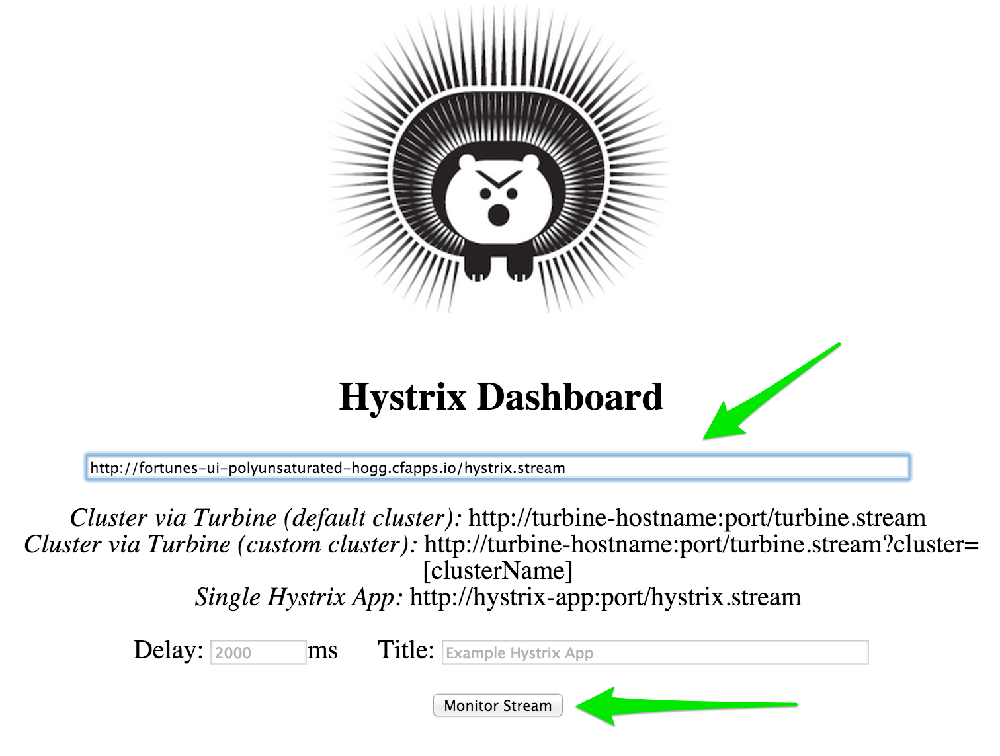
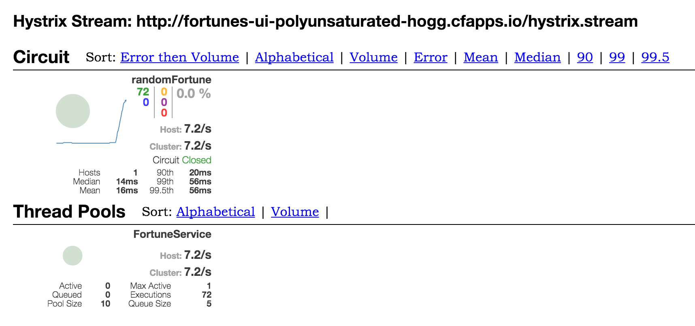
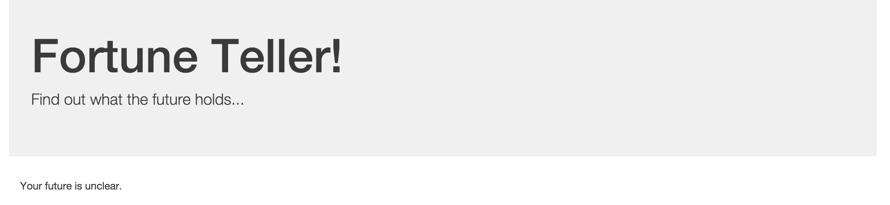

:compat-mode:
= Lab 5 - Pushing a Spring Cloud Microservices Architecture

== Build and Push!

. Change to the _Fortune Teller_ sample application directory:
+
----
$ cd $COURSE_HOME/lab_05/fortune-teller
----

. Using the Gradle Wrapper, build and package the application:
+
----
$ ./gradlew assemble
----
+
The Gradle Wrapper will automatically download the appropriate version of Gradle for this project along with all of _Fortune Teller_'s dependencies. This may take a few moments.

. Push the Spring Cloud services:
+
----
$ cf push -f manifest-services.yml
----
+
This will push a Spring Cloud Config Server, a Eureka server, and a Hystrix Dashboard, all with random routes.

. Edit `scripts/create_services.sh` to add the random routes that were generated for you:
+
----
cf cups config-service -p '{"uri":"http://config-server-fluxional-suttee.cfapps.io"}'
cf cups service-registry -p '{"uri":"http://eureka-unprevalent-toper.cfapps.io"}'
cf cs elephantsql turtle fortunes-db
----

. Run `scripts/create-services.sh` to create the services that you need:
+
----
$ scripts/create_services.sh
Creating user provided service config-service in org platform-eng / space nfjs-workshop as mstine@pivotal.io...
OK
Creating user provided service service-registry in org platform-eng / space nfjs-workshop as mstine@pivotal.io...
OK
Creating service fortunes-db in org platform-eng / space nfjs-workshop as mstine@pivotal.io...
OK
----

. Push the microservices:
+
----
$ cf push -f manifest-apps.yml
----
+
This will push the fortunes service and the ui application.

. In a browser, access the fortunes-ui application at the route that was created for you:
+
image:../Common/images/fortunes_1.png[]

. Now, in another browser tab, access the Hystrix Dashboard at the route that was created for you.
Enter the route for the UI application and click the ``Monitor Stream.''
+

. Access the fortunes-ui and show that the circuit breaker is registering successful requests.
+

. Stop the fortunes application:
+
----
$ cf stop fortunes
----

. Access the fortunes-ui and see that the ``fallback fortune'' is being returned.
+

. Access the fortunes-ui and show that the circuit breaker is registering short-circuited requests.
+
image:../Common/images/fortunes_5.png[]

. Start the fortunes application:
+
----
$ cf start fortunes
----

. Continue to access the fortunes-ui and watch the dashboard.
After the fortunes service has re-registered with Eureka and the fortunes-ui load balancer caches are refreshed, you will see the circuit breaker recover.
You should then start getting random fortunes again!
